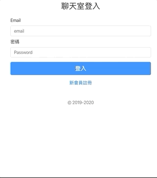

<p align="center">
  <a href="#">
    
  </a>
</p>

<h3 align="center"> Real-time public chatroom </h3>
<h3 align="center"> 即時聊天室</h3>
<a href="https://chatroom-nodejs-vue.onrender.com/">
  <p align="center">Click here to the demo site</p>
</a>

## Table of Contents
- [About this project](#about-this-project)
- [How to use](#how-to-use)
- [Run the local server](#run-the-local-server)
- [Run the frontend server](#run-the-frontend-server)

## About this project 
<p>A real-time web application built by Socket.io, Node.js, Vue.js, MySQL, and etc.</p>
<p>一個應用即時聊天程式，運用 Socket.io / Node.js / Vue.js / MySQL 等套件組合而成。</p>

- [開發詳述過程 ＠Blog](https://smlpoints.com/build-a-public-chatroom-with-vue-mysql-socketio-passport-jwt.html)

## How to use
**Website 網站**
<p>After logging in, enter what you would like to say in the public chatroom. Everyone ( including yourself ) can see all messages without refreshing the page.</p>
<p>註冊登入後，輸入要傳遞給公開聊天室的訊息，所有人包含自己可以即時看到結果。</p>
<p align="center">
    
</p>

## Source Kits used in this project
**Front End**
- [axios](https://github.com/axios/axios) - Promise based HTTP client for the browser and node.js
- [bootstrap](https://getbootstrap.com/) - Build responsive, mobile-first projects on the web with the world’s most popular front-end component library.
- [sweetalert2](https://sweetalert2.github.io/) - A beautiful, responsive, customizable popup boxes
- [Vue-socket.io](https://www.npmjs.com/package/vue-socket.io) - This is an integration for Vuejs, easy to use, supporting Vuex and component level socket consumer managements.

**Back End**
- [cors](https://www.npmjs.com/package/cors) - To activate Cross-Origin Resource Sharing
- [faker](https://www.npmjs.com/package/faker) - To generate the seed data for testing
- [socket.io](https://www.npmjs.com/package/socket.io) - "Socket IO" enables real-time bidirectional event-based communication.

## Run the local server
### Prerequisites
- [npm](https://www.npmjs.com/get-npm)
- [Node.js v10.16.0](https://nodejs.org/en/download/)
- [MySQL Workbench](https://dev.mysql.com/downloads/workbench/)

### Clone

Clone this repository to your local machine

```
$ git clone https://github.com/andy922200/chatroom-nodejs-vue.git
```
### Setup Database
**Create database via MySQL Workbench Panel**

```
> Run the following code
drop database if chatroom;
create database chatroom;
```

### Setup the Project on your device
**1. Enter the project folder**
```
$ cd chatroom
```
**2. Install packages via npm**

```
$ npm install
```
**3. Edit password in config.json file**
```
> /server/config/config.json
"development": {
  "username": "root",
  "password": "<YOUR_WORKBENCH_PASSWORD>",
  "database": "chatroom",
  "host": "127.0.0.1",
  "dialect": "mysql"
}
```
**4. Run migration**
```
> run the following code in the console  @ "/server"
$ cd /server
$ npx sequelize db:migrate
```
**5. Add Seeder**
```
> run the following code in the console  @ "/server"
$ npx sequelize db:seed:all
```
**6. Activate the server**
```
$ npm run dev
```
**7. Find the message on your console**
```
If you see the following message, the backend server is running.
> App is listening on port 3000!
```

## Run the frontend server
**1. Enter the project folder**
```
> Open a new terminal window and enter the client folder
$ cd chatroom/client
```
**2. Install packages via npm**
```
$ npm install
```
**3. Add vue.config.js**
```
$ touch vue.config.js
```
**4. Add the following setting in vue.config.js**
```
> /client/vue.config.js
const path = require('path')

module.exports = {
  outputDir: path.resolve(__dirname, '../server/public'),
  devServer: {
    proxy: {
      '/api': {
        target: 'http://localhost:3000'
      }
    },
  }
}
```
**5. Compiles the webpack for development**
```
$ npm run serve
```
**6. Find the message on your console**
```
If you see the following message, the client server is running.
> App running at:
  - Local:   http://localhost:8080/
  - Network: http://<Your Virtual IP>:8080/
```

## Author
- [Andy Lien](https://github.com/andy922200)